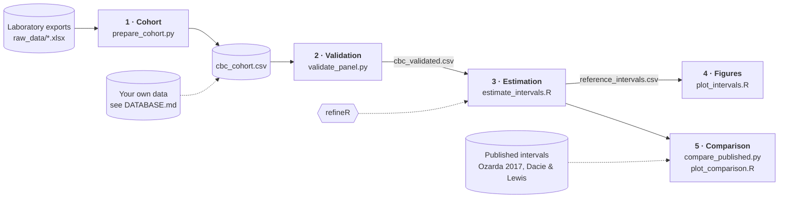

# Indirect CBC reference intervals for an outpatient population in Uzbekistan

This project estimates local reference intervals for 17 complete blood count (CBC)
parameters from routine outpatient results. It uses 30,512 validated blood counts
collected at 178 collection points in Tashkent city and Tashkent region between
January 2023 and January 2024, all measured on Mindray BC-6800Plus analysers.

Routine results mix healthy and pathological patients, so the analysis uses refineR to
recover the healthy component, separately for men ≥15, women ≥15 and children 1–14.

It accompanies the paper:

> Madaminov M, Kadirov M. Indirect reference intervals for 17 complete blood count
> parameters in an outpatient population in Uzbekistan. *Submitted.*


The repository contains the scripts that derive the analytic cohort from the raw
laboratory exports, and the code that produces every published interval, table and
figure. The intervals themselves, with their 90% confidence bounds (Tables 1–3 of the
paper), are in [`results/reference_intervals.csv`](results/reference_intervals.csv),
and Figures 1–3 are in [`figures/`](figures).

**It contains no patient data.** The source exports carry names, addresses and
telephone numbers, and remain with the data owner.

## Contents

- [Pipeline](#pipeline)
- [Quick start](#quick-start)
- [Notes on the intervals](#notes-on-the-intervals)
- [Notes on the extraction](#notes-on-the-extraction)
- [Layout](#layout)
- [Requirements](#requirements)
- [Citation and licence](#citation-and-licence)

## Pipeline



| Step | Script | Output |
|---|---|---|
| 1 | `prepare_cohort.py` | `data/cbc_cohort.csv`, `results/result_exclusion_table.csv` |
| 2 | `validate_panel.py` | `data/cbc_validated.csv`, `results/validation_report.txt` |
| 3 | `estimate_intervals.R` | `results/reference_intervals.csv`, diagnostic plots, session info |
| 4 | `plot_intervals.R` | `figures/figure1_reference_intervals`, `figures/figure2_all_parameters` |
| 5 | `compare_published.py`, `plot_comparison.R` | comparison tables (printed), `figures/figure3_published_comparison` |

1. **Cohort** reads the monthly laboratory exports, removes pre-analytical failures,
   implausible values, implausible ages, infants under one year and duplicate records,
   and writes one de-identified row per blood count.
2. **Validation** rejects records whose calculated indices (MCV, MCH, MCHC,
   plateletcrit) disagree with their measured inputs, values outside physiological
   limits, and differentials that do not sum to 100%.
3. **Estimation** fits refineR (Box–Cox model) to each parameter in each partition.
   Each limit gets a 90% confidence interval from 200 bootstrap replicates, and is
   compared with the empirical 2.5th–97.5th percentiles; its displacement is reported
   as a percentage of the empirical interval width.
4. **Figures** draws Figures 1 and 2 of the paper from the intervals table.
5. **Comparison** sets the adult intervals beside a direct-method study (Ozarda 2017)
   and a textbook (Dacie & Lewis), and the paediatric intervals beside the textbook's
   age bands. It reproduces Table 4 and the comparisons in the paper's Results, and
   draws Figure 3. The published values are transcribed, with their sources, at the
   head of each script.

`establish_bounds.py` is the diagnostic behind the limits applied in step 2. It
reports how many records fail each check and applies nothing.

Each script states its rules, with their rationale and sources, in its comments.

## Quick start

```bash
git clone https://github.com/DigitAll-U/indirect-cbc-ri-uzbekistan.git
cd indirect-cbc-ri-uzbekistan
Rscript -e 'install.packages(c("refineR", "dplyr", "ggplot2"))'
```

**To reproduce the figures and the comparison with published intervals,** no data is
needed. These read only the committed intervals table:

```bash
Rscript scripts/plot_intervals.R
Rscript scripts/plot_comparison.R
python scripts/compare_published.py
```

**To run the full pipeline** on the original laboratory exports:

```bash
./run_all.sh      # Linux / macOS
.\run_all.ps1     # Windows
```

Step 3 is slow because of the bootstrap: about 4.5 hours for all 51 fits on a 16-core
machine, and longer with fewer cores. It writes `reference_intervals_partial.csv` after
every fit, so an interrupted run loses one parameter rather than all of them.

**To run it on your own data,** prepare `data/cbc_cohort.csv` as described in
[DATABASE.md](DATABASE.md), then start at step 2:

```bash
python scripts/validate_panel.py
Rscript scripts/estimate_intervals.R
Rscript scripts/plot_intervals.R
```

Step 5 compares the paper's own intervals with published values, so it is only
meaningful for this study's data.

## Notes on the intervals

- The intervals apply to the Mindray BC-6800Plus and should be verified before use on
  another analyser.
- The lower limits for haemoglobin and haematocrit in women should not be adopted
  without confirmation by a direct study; see the paper's Discussion.
- refineR samples internally with a random seed, which defaults to 123. The published
  intervals use that default; changing it shifts the estimates in the third decimal.

## Notes on the extraction

The monthly exports arrive in three column schemas and label tests in Russian and Uzbek,
sometimes with Cyrillic characters visually identical to Latin ones (М/M, С/C, Н/H).
`prepare_cohort.py` matches tests by normalised name through a homoglyph translation
table rather than by column position, because positions are not stable between months.

## Layout

```
├── DATABASE.md     format of the analytic dataset
├── run_all.sh      full pipeline, Linux / macOS
├── run_all.ps1     full pipeline, Windows
├── scripts/        the pipeline scripts above
├── raw_data/       laboratory exports (git-ignored)
├── data/           cohort and validated cohort (git-ignored)
├── results/        intervals table
└── figures/        Figures 1–3 of the paper, PNG and PDF
```

The intervals table and the figures are committed. Every other output (exclusion
table, validation report, diagnostic plots, session info) is written to `results/` on
each run.

Paths default to these folders and can be changed in `.env` (see `.env.example`).

## Requirements

- Python 3.8+ (standard library only)
- R with `refineR`, `dplyr` and `ggplot2`

The published results were produced with Python 3.12, R 4.5.2 and refineR 2.0.0. Each
run records its R versions in `results/session_info.txt`.

## Citation and licence

Cite the paper above, or this code via [CITATION.cff](CITATION.cff).
Released under the MIT licence; see [LICENSE](LICENSE).
